# EDA report — RL-Boreholes

Run before training to characterise the corpus and the design choices it forced.  Figures live in this folder.

## 1. Data census

- **8,517,438** rows total · **2,069** unique wells
- **NLOG**: 1,537 wells (Dutch onshore + Dutch sector of the North Sea)
- **LILY**: 532 wells (IODP scientific drilling, global)

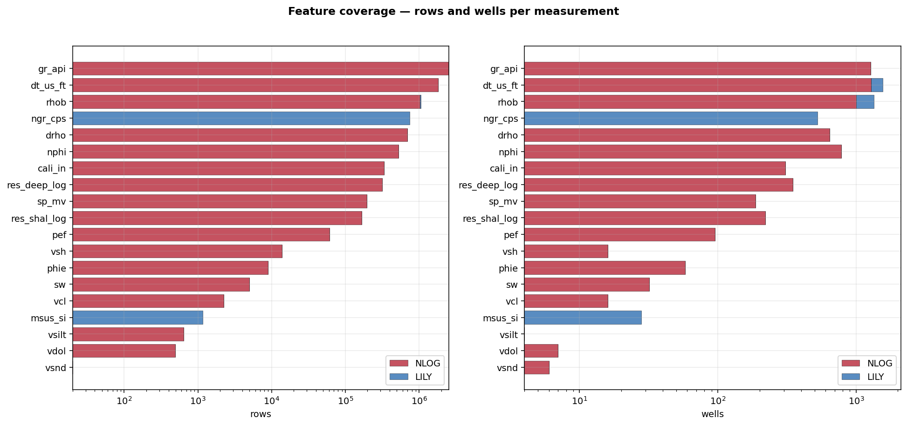

**Figure 1** combines (a) total samples per measurement per dataset, (b) row counts per rock-type label, and (c) the depth histogram for each corpus.  LILY skews shallow (ocean-floor cores, < 1 km below seafloor) and NLOG covers depth ~0-6 km.

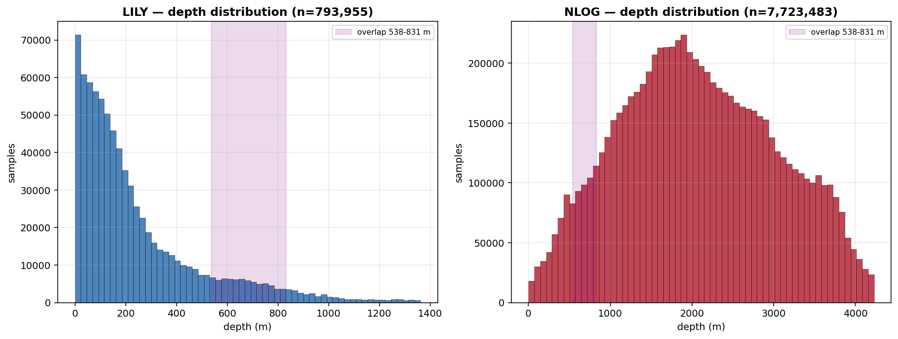

**Figure 2** — LILY and NLOG depth histograms side by side.

## 2. Geographic coverage

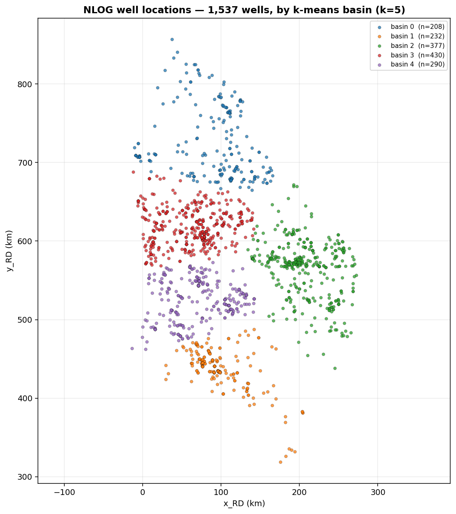

**Figure 3** — every NLOG well plotted on the Rijksdriehoek grid, coloured by basin (k-means cluster k=5 on (x_rd, y_rd) means per well).  Basin stratification ensures the simulator doesn't over-sample whichever region has the most logged wells.

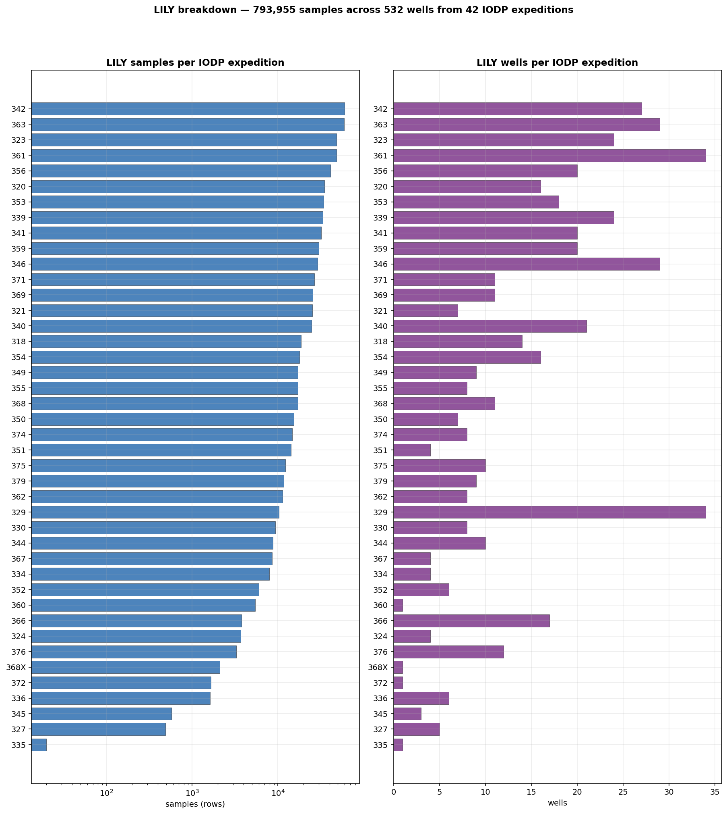

**Figure 6** — LILY samples and wells broken down by IODP expedition number.  Expeditions are coherent regional sets (318 = Wilkes Land, 329 = South Pacific Gyre, 336 = North Atlantic, etc.) and stand in for a regional split since LILY lacks RD coordinates.

## 3. Lithology

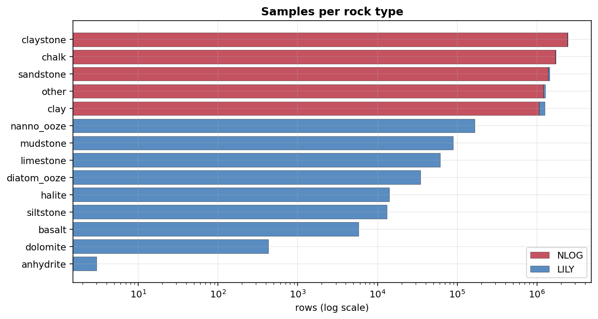

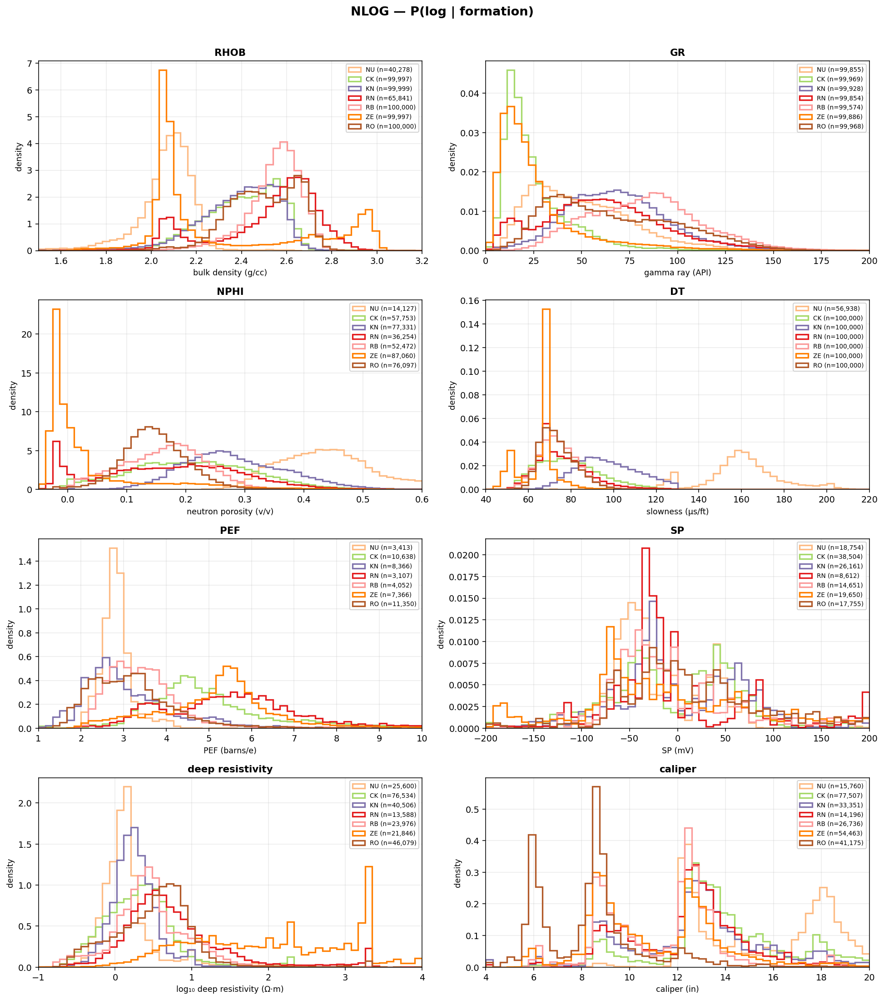

**Figures 4-5** — sample counts per rock_type and per NLOG formation respectively.  These set the per-(rock, formation) cells the simulator's `DistributionBank` and `FormationGeometry` tables are fit against.

## 4. Petrophysics

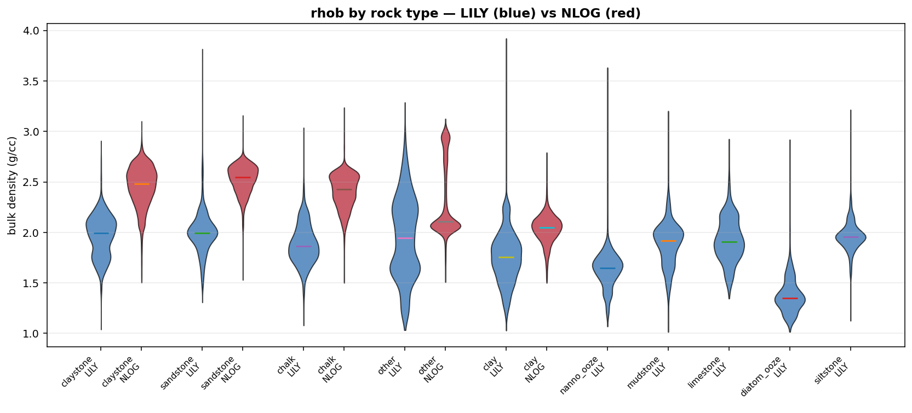

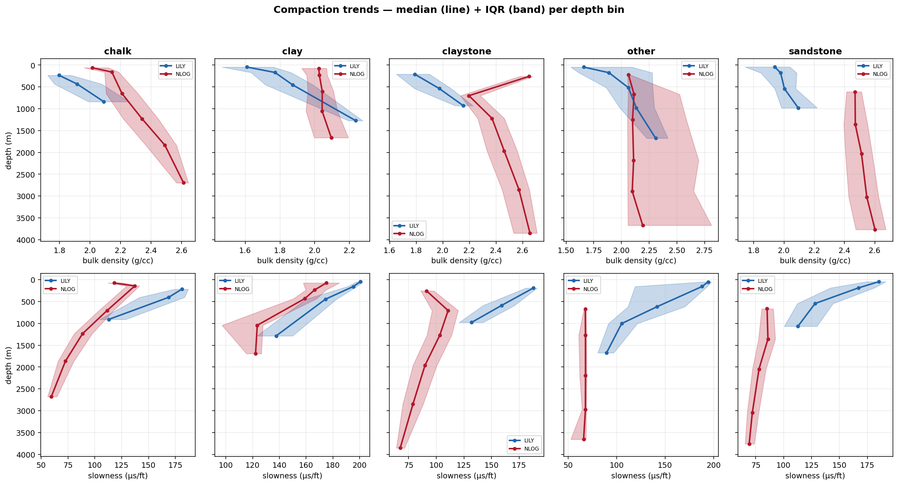

**Figure 8** — per-rock medians shift visibly with depth.  This shift is the empirical justification for binning the distribution bank into depth slices (7 bins: [0, 100, 300, 800, 1500, 2500, 3500, 5000]).  Without depth binning, the simulator would draw a shallow clay's density for a 3 km clay.

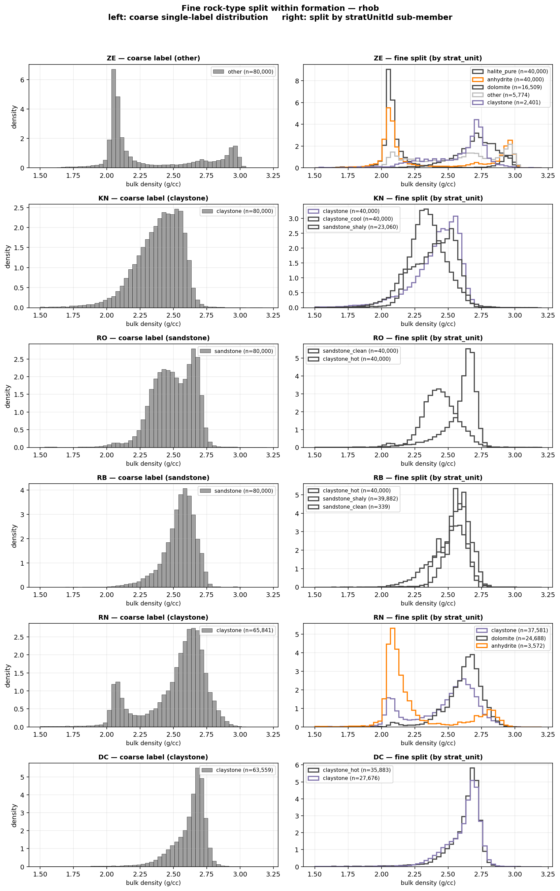

**Figure 9** — IQR-reduction by sub-class.  Top entries:

| formation | measurement | coarse IQR | fine IQR | reduction % |
|---|---|---|---|---|
| ZE | rhob | 0.6269 | 0.328 | **47.7%** |
| RO | gr_api | 52.469 | 32.0366 | **38.9%** |
| RO | rhob | 0.2393 | 0.1536 | **35.8%** |
| SL | res_shal_log | 0.4552 | 0.3123 | **31.4%** |
| RO | vcl | 0.4531 | 0.3177 | **29.9%** |

Splitting `claystone` → `claystone_hot`/`claystone_cool` and `sandstone` → `sandstone_clean`/`sandstone_shaly` reduces within-class IQR by tens of percent, so the encoder can see distinct distributions instead of one wide blob.

## 5. Design decisions justified by the data

### 5.1 Variable choice (drop PEF)

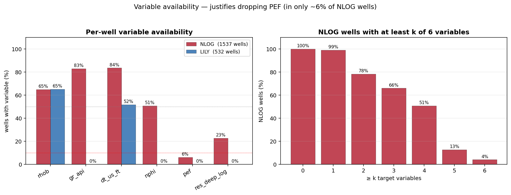

- **PEF**: 6.2% of NLOG wells have it. Training on a channel that is zero-imputed in ~94% of boreholes degrades the encoder; we drop PEF.
- All 6 candidate variables present in only 4.1% of NLOG wells; the final 5-variable set `['rhob', 'gr_api', 'dt_us_ft', 'nphi', 'res_deep_log']` is what the simulator generates and the encoder consumes.

### 5.2 LILY ⊕ NLOG pooling

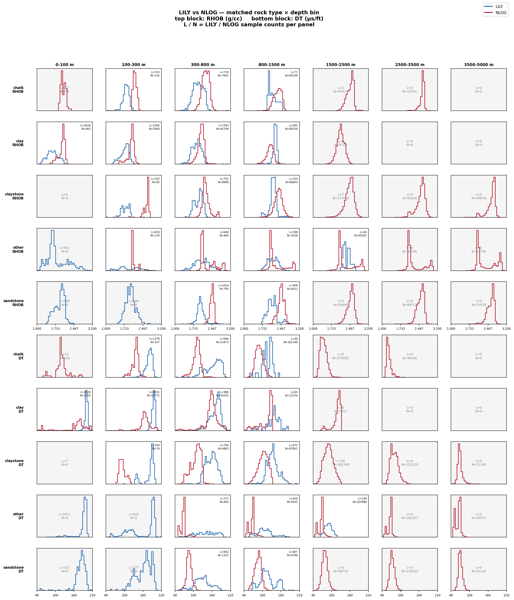

- 31 (rock × measurement × depth-bin) cells have both corpora; **24** flag as materially disagreeing (|Δmedian| > pooled IQR).
- Pooling the two corpora extends the empirical support (see `support_bounds.csv` for the `extends` column) but would bias absolute values where the two disagree.  The simulator therefore samples from rock-stratified pools, not the marginal.

### 5.3 Empirical clipping bounds

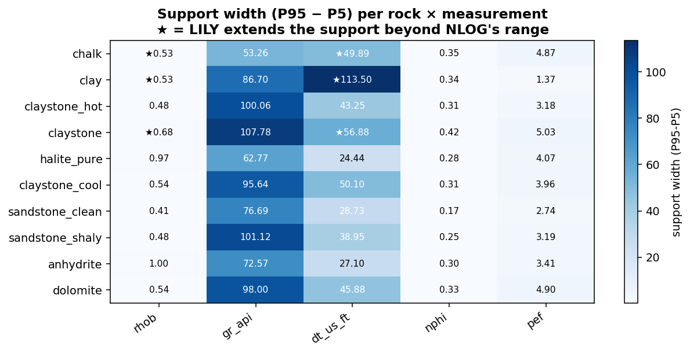

- For every (rock × variable) cell the simulator clips at the empirical [0.5%, 99.5%] percentiles (rather than a single global hard bound).  See `support_bounds.csv` for the per-rock 5/50/95 percentiles used to derive the clipping windows.
- Effect: the simulator stops emitting a claystone with halite-like density just because the global hard bound allows it.

## 6. Tables (CSV)

| File | Contents |
|---|---|
| `coverage_matrix.csv` | rows/wells/rocks per (dataset, measurement) |
| `summary_per_category.csv` | p10/p50/p90/IQR per (dataset, measurement, category) |
| `compaction_trends.csv` | p25/p50/p75 per (rock × variable × depth-bin) |
| `depth_matched_summary.csv` | LILY vs NLOG at matched depth bins |
| `fine_vs_coarse_comparison.csv` | IQR reduction from rock-class splits |
| `support_bounds.csv` | per-rock empirical [p05, p50, p95] |
