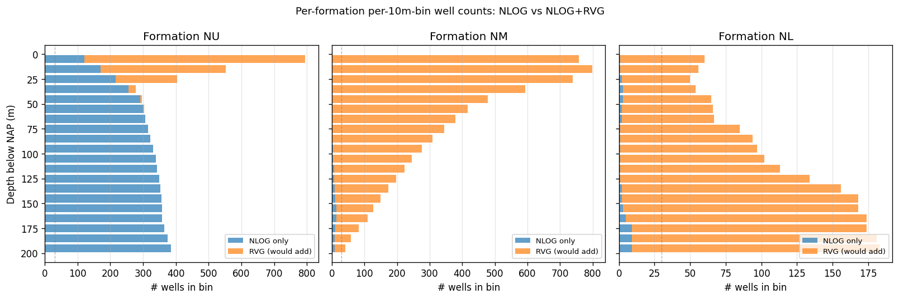
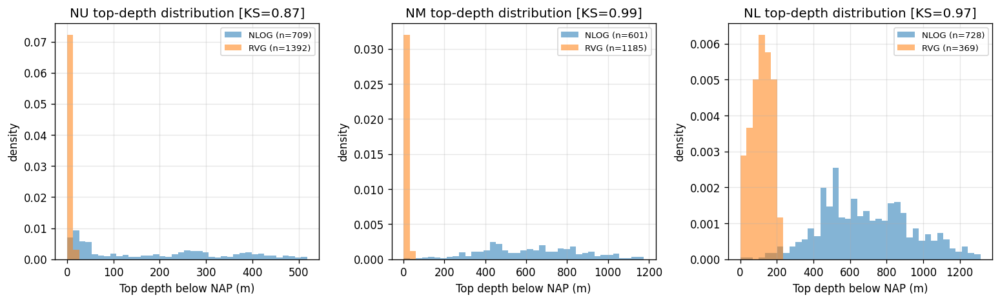

# RVG gap analysis -- does the Garcon dataset improve our pipeline?

*Generated by `scripts/diagnostics/rvg_gap_analysis.py`.*

Question: would adding the 1,394 Roer Valley Graben (RVG) boreholes
from Garzón et al. (2026) materially improve the simulator's
shallow stratigraphy (NU/NM/NL = Upper/Middle/Lower North Sea Group)?

All depths are in metres below NAP (positive going down).

## 1. Per-formation per-10m-bin coverage uplift (0--200m)

Number of unique wells per formation per 10m depth bin, NLOG vs
what RVG would add.  KDE threshold ~30 samples shown as grey
vertical line on the figure.

Headline:
- **NU**: NLOG places 6208 well-bins in 0--200m; RVG would add 1273. Bins above KDE threshold ($\geq$30 wells): 20 -> 20.
- **NM**: NLOG places 111 well-bins in 0--200m; RVG would add 6386. Bins above KDE threshold ($\geq$30 wells): 0 -> 20.
- **NL**: NLOG places 59 well-bins in 0--200m; RVG would add 2188. Bins above KDE threshold ($\geq$30 wells): 0 -> 20.

## 2. Top-depth distribution shift

Per-well top-depth distribution for each formation, NLOG vs RVG,
with the Kolmogorov-Smirnov distance between them:

| formation | nlog_n | nlog_median | nlog_p25 | nlog_p75 | rvg_n | rvg_median | rvg_p25 | rvg_p75 |
|---|---|---|---|---|---|---|---|---|
| NU | 709 | 128.3 | 21.5 | 319.6 | 1392 | -19.5 | -28.0 | -10.4 |
| NM | 601 | 638.9 | 445.1 | 822.7 | 1185 | -0.8 | -10.9 | 10.6 |
| NL | 728 | 691.6 | 517.8 | 892.3 | 369 | 102.7 | 38.0 | 148.3 |

KS distances: NU KS=0.87, NM KS=0.99, NL KS=0.97.

## 3. Lithology vocabulary alignment

RVG basisdata has 69,877 lithology intervals across
27 distinct codes.  Mapping to our `rock_type_fine`
vocabulary:

| rvg_litho_code | n | rock_type_fine |
|---|---|---|
| Z | 49091 | sandstone_clean |
| K | 11480 | claystone_cool |
| L | 4185 | claystone_cool |
| G | 2817 | sandstone_clean |
| V | 906 | claystone_hot |
| BRK | 711 | claystone_hot |
| SHE | 349 | chalk |
| ZNS | 82 | sandstone_clean |
| GCZ | 67 | sandstone_shaly |
| GY | 60 | claystone_hot |
| KAS | 28 | chalk |
| LEI | 26 | claystone_cool |
| STN | 15 | sandstone_clean |
| SIS | 12 | sandstone_shaly |
| STK | 11 | claystone_hot |
| DOL | 8 | dolomite |
| HO | 7 | unmapped |
| SID | 6 | unmapped |
| DET | 5 | unmapped |
| OER | 2 | unmapped |
| GM | 2 | unmapped |
| SHA | 2 | claystone_cool |
| PL | 1 | unmapped |
| PU | 1 | unmapped |
| KWS | 1 | unmapped |
| MER | 1 | chalk |
| KWA | 1 | unmapped |

Total mapped: 69,851 (100.0%).
Unmapped: 26.

## 4. Transition-matrix change in NU upper 100m

Frobenius distance between the NLOG-only and NLOG+RVG Markov chain
on `rock_type_fine` in formation NU, depths 0--100m, on rocks ['chalk', 'clay', 'claystone_cool', 'claystone_hot', 'sandstone_clean']: **1.506**.

For reference, the v3 simulator's worst per-formation Frobenius
distance against real data is around 1.0 (RB/RO before the calibration
fix).  Anything above 0.3 here would be a meaningful change.

## Recommendation

**PROCEED with integration**: RVG fills a clear shallow coverage gap (especially in NM and NL), the lithology vocabulary aligns cleanly, and the transition matrix shifts measurably.

## Notes

- RVG covers the southern Netherlands (Roer Valley Graben). Adding it tilts the simulator toward this basin's stratigraphy. That is desirable if the simulator is meant to represent Dutch subsurface variability; less so if the user expects a North-Netherlands-only generator.
- RVG provides no wireline channels.  Any integration affects Formation Geometry only, not the Distribution Bank.
- The Discovery Prior is untouched (no hydrocarbon labels in RVG).