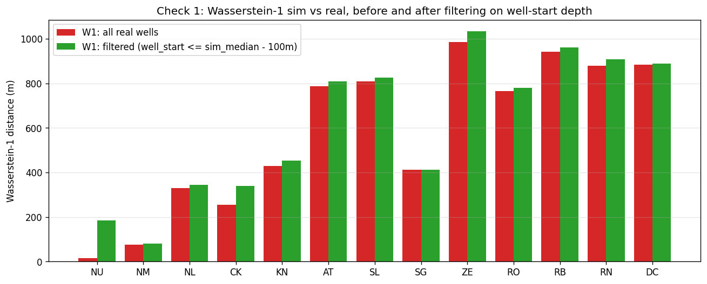
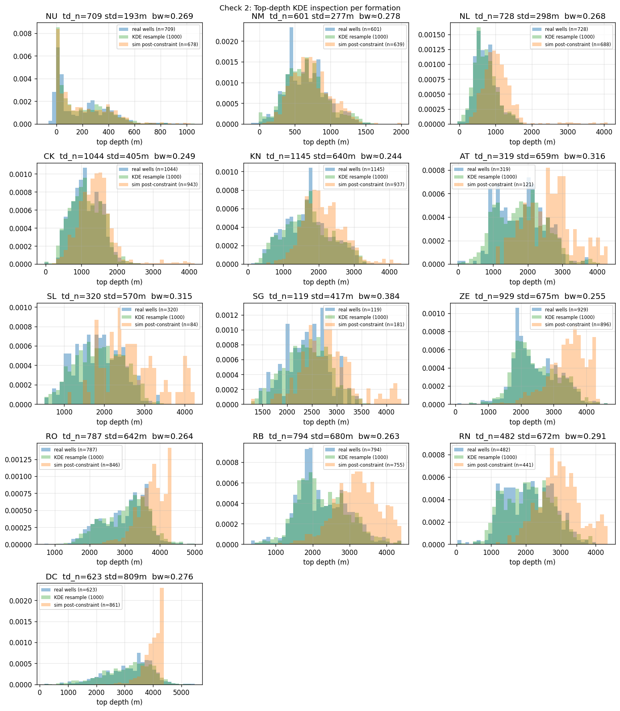

# Top-depth dispersion audit -- is the simulator really under-dispersed?

*Generated by `scripts/diagnostics/topdepth_dispersion_audit.py`.*

## Check 1 -- well-start contamination

For each real well we recorded its actual start depth (`min(depth)`).  Oil/gas wells often start hundreds of metres below the shallow Cenozoic; their 'top' for a shallow formation is then the well's start depth, not the formation's geological top.  We filter to wells whose start depth is more than 100 m above the simulator's median sim top for that formation, then recompute Wasserstein-1.

| formation | W1 all (m) | W1 filtered (m) | drop |
|---|---|---|---|
| NU | 15 | 185 | -1161% |
| NM | 75 | 81 | -8% |
| NL | 330 | 344 | -4% |
| CK | 256 | 339 | -32% |
| KN | 429 | 454 | -6% |
| AT | 786 | 809 | -3% |
| SL | 810 | 826 | -2% |
| SG | 412 | 412 | 0% |
| ZE | 985 | 1034 | -5% |
| RO | 765 | 780 | -2% |
| RB | 942 | 962 | -2% |
| RN | 879 | 908 | -3% |
| DC | 883 | 888 | -1% |

**Median drop after filtering: -3%.**

## Check 2 -- top-depth KDE bandwidth

Per formation, compare the real-data standard deviation of the fitted tops, the KDE-resample standard deviation, and the sim-post-constraint standard deviation.

| formation | n_fit | real std (m) | KDE-resample std (m) | sim post std (m) | bw factor |
|---|---|---|---|---|---|
| NU | 709 | 193 | 187 | 194 | 0.269 |
| NM | 601 | 277 | 294 | 267 | 0.278 |
| NL | 728 | 298 | 307 | 465 | 0.268 |
| CK | 1044 | 405 | 434 | 510 | 0.249 |
| KN | 1145 | 640 | 672 | 573 | 0.244 |
| AT | 319 | 659 | 701 | 713 | 0.316 |
| SL | 320 | 570 | 602 | 712 | 0.315 |
| SG | 119 | 417 | 455 | 523 | 0.384 |
| ZE | 929 | 675 | 689 | 574 | 0.255 |
| RO | 787 | 642 | 648 | 412 | 0.264 |
| RB | 794 | 680 | 685 | 601 | 0.263 |
| RN | 482 | 672 | 702 | 601 | 0.291 |
| DC | 623 | 809 | 849 | 332 | 0.276 |

Median ratio of sim-post-std / real-std across formations: **0.96** (1.0 = simulator matches real spread; <<1.0 = simulator under-disperses).

## Check 3 -- retry-loop fallback rate

Out of 1000 simulated columns, **712 (71.2%) fell through to the median-collapse path** after exhausting the 20-retry loop.

## Check 4 -- combination diversity

In 1000 sim draws: **34 unique formation combinations**, top-3 combinations cover **41%** of draws.

In the 146 real NLOG wells reaching >=4000m: **57 unique combinations**, top-3 cover **31%**.

## Verdict

**A3 fires** -- the 20-retry loop falls through to the median path more than 30% of the time. Suggested fix: raise `MAX_RESAMPLES`, relax `MIN_LAYER_THICKNESS_DEFAULT`, or use a random fallback instead of the median.

## Implication for Phase 2 (RVG integration)

There is a genuine simulator defect (A2/A3/A4). Apply the small fix BEFORE RVG integration. After the fix, Phase 2's value-add is cleaner to measure.