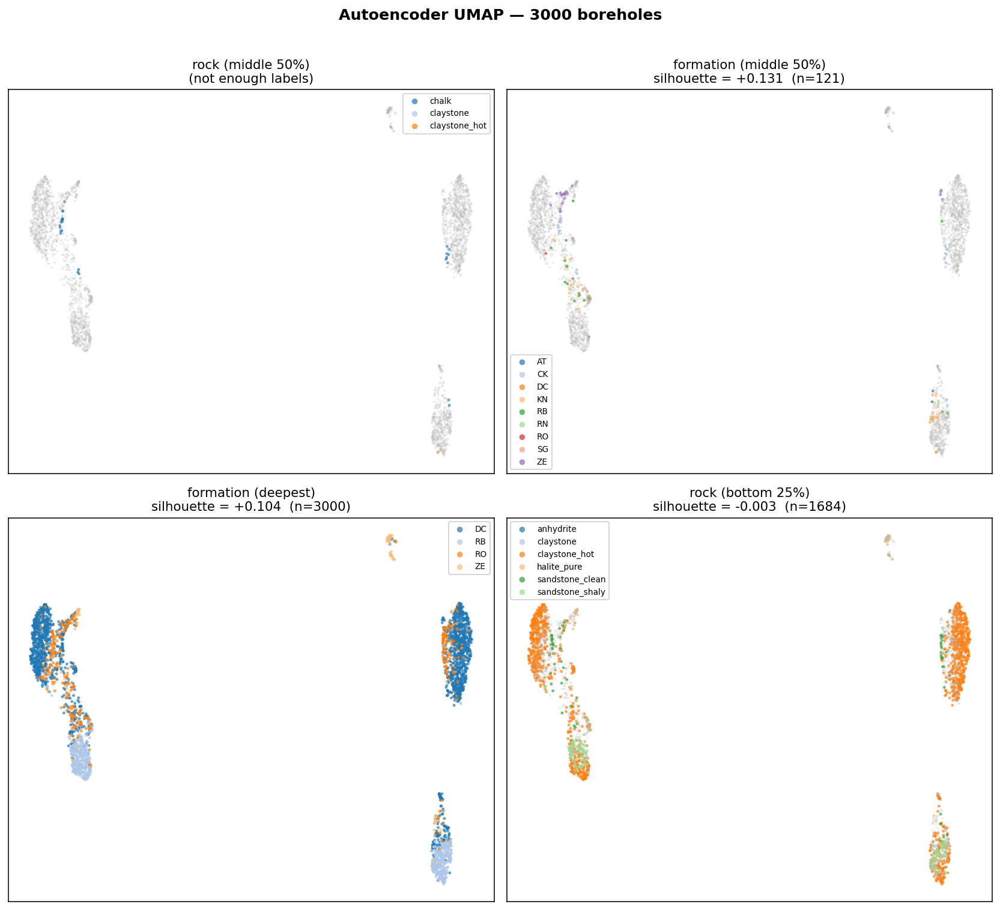
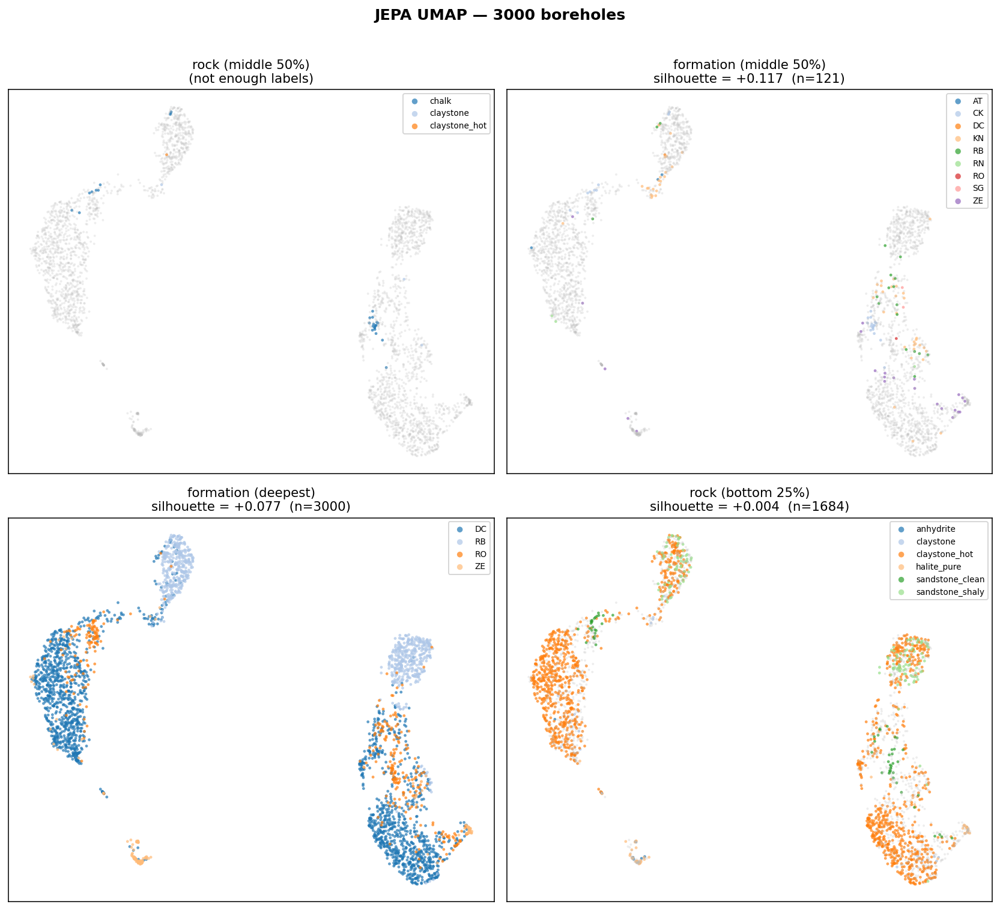
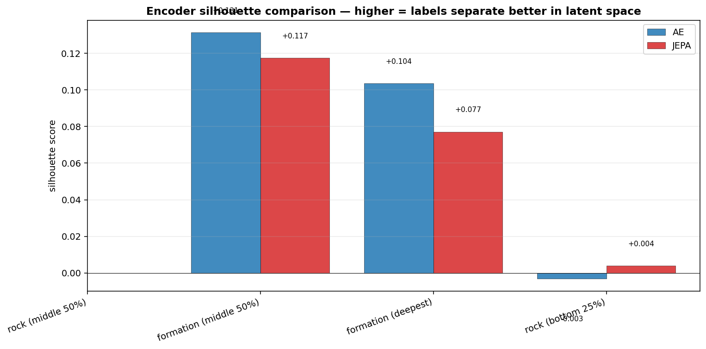
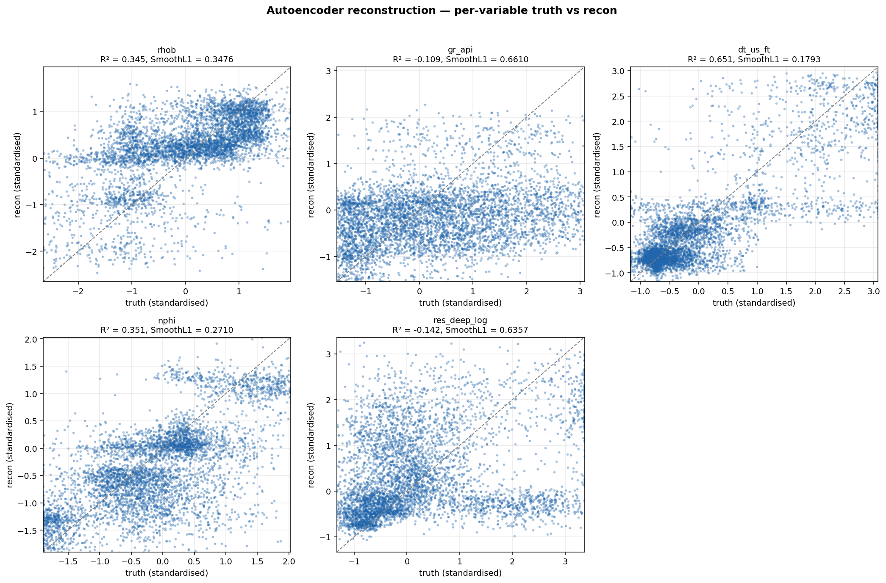

# Encoder evaluation report

Validation set: **3,000 independent borehole columns** (each column has its own freshly-sampled stratigraphic stack).

Encoders evaluated: autoencoder, JEPA.

## 1. UMAP latent space, coloured by label scheme

Each 2×2 panel reuses the same UMAP projection of the encoder's latents, coloured by four different label schemes:

- **rock (middle 50%)** — dominant rock in the central depth window
- **formation (middle 50%)** — dominant formation in the same window
- **formation (deepest)** — formation reached at total depth
- **rock (bottom 25%)** — dominant rock in the deep window

Silhouette score reads: > +0.3 strong, +0.1-0.3 modest, ~0 random.

## 2. Silhouette comparison

Per-label-set silhouette:

| label set | AE | JEPA |
|---|---|---|
| formation (deepest) | +0.104 | +0.077 |
| formation (middle 50%) | +0.131 | +0.117 |
| rock (bottom 25%) | -0.003 | +0.004 |
| rock (middle 50%) | — | — |

## 3. Autoencoder reconstruction quality

Per-variable reconstruction error (standardised units):

| variable | R² | SmoothL1 | n cells |
|---|---|---|---|
| rhob | 0.356 | 0.3538 | 1,320,000 |
| gr_api | -0.072 | 0.6444 | 1,320,000 |
| dt_us_ft | 0.655 | 0.1803 | 1,320,000 |
| nphi | 0.381 | 0.2674 | 1,320,000 |
| res_deep_log | -0.108 | 0.6319 | 1,320,000 |

R² ≈ 1 and SmoothL1 ≪ 1 indicate the autoencoder can reconstruct each channel from the latent.  Drops on a specific variable point to information loss in the bottleneck.

## 4. Files

- `silhouette_summary.csv` — silhouette per (encoder × label set)
- `ae_reconstruction.csv` — per-variable R² and SmoothL1 for the AE
- `01_ae_umap.png`, `02_jepa_umap.png` — per-encoder UMAP grids
- `03_silhouette_comparison.png` — grouped bar chart
- `04_ae_reconstruction.png` — per-variable truth-vs-recon scatter
