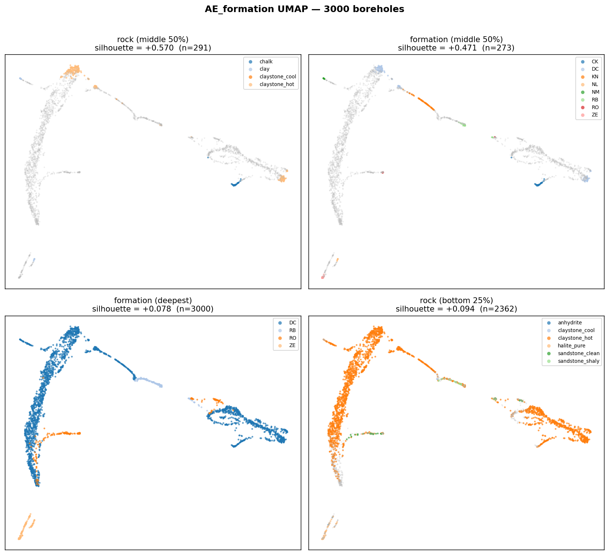
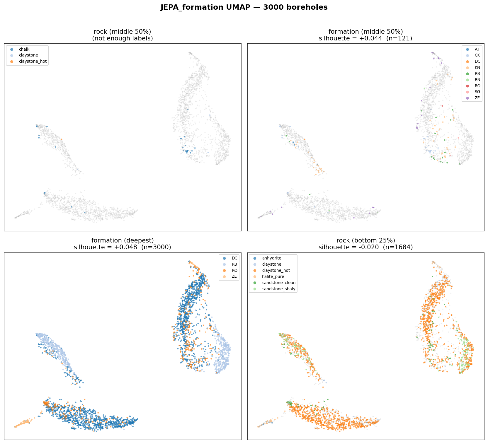
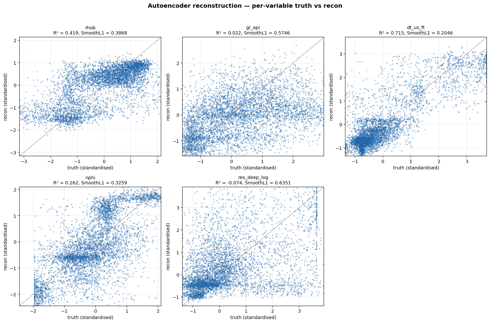

# Encoder evaluation report

Validation set: **3,000 independent borehole columns** (each column has its own freshly-sampled stratigraphic stack).

Encoders evaluated: AE, JEPA, AE_formation, JEPA_formation.

Naming: `*_formation` variants were trained on the formation-resolution dataset (`data/dataset_formation/`); the bare names are the rock-resolution baselines (`data/dataset/`).

## 1. UMAP latent space, coloured by label scheme

Each 2×2 panel reuses the same UMAP projection of the encoder's latents, coloured by four different label schemes:

- **rock (middle 50%)** — dominant rock in the central depth window
- **formation (middle 50%)** — dominant formation in the same window
- **formation (deepest)** — formation reached at total depth
- **rock (bottom 25%)** — dominant rock in the deep window

Silhouette score reads: > +0.3 strong, +0.1-0.3 modest, ~0 random.

## 2. Silhouette comparison

Per-label-set silhouette:

| label set | AE | JEPA | AE_formation | JEPA_formation |
|---|---|---|---|---|
| formation (deepest) | +0.111 | +0.138 | +0.106 | +0.048 |
| formation (middle 50%) | +0.115 | +0.150 | +0.121 | +0.044 |
| rock (bottom 25%) | +0.003 | -0.044 | -0.003 | -0.020 |
| rock (middle 50%) | — | — | — | — |

## 3. Autoencoder reconstruction quality

### AE

| variable | R² | SmoothL1 | n cells |
|---|---|---|---|
| rhob | 0.436 | 0.3121 | 1,320,000 |
| gr_api | 0.174 | 0.5349 | 1,320,000 |
| dt_us_ft | 0.732 | 0.1479 | 1,320,000 |
| nphi | 0.447 | 0.2440 | 1,320,000 |
| res_deep_log | -0.046 | 0.5824 | 1,320,000 |

### AE_formation

| variable | R² | SmoothL1 | n cells |
|---|---|---|---|
| rhob | 0.431 | 0.3926 | 1,320,000 |
| gr_api | 0.066 | 0.5538 | 1,320,000 |
| dt_us_ft | 0.721 | 0.2039 | 1,320,000 |
| nphi | 0.299 | 0.3216 | 1,320,000 |
| res_deep_log | -0.035 | 0.6263 | 1,320,000 |

R² ≈ 1 and SmoothL1 ≪ 1 indicate the autoencoder can reconstruct each channel from the latent. Drops on a specific variable point to information loss in the bottleneck.

## 4. Files

- `silhouette_summary.csv` — silhouette per (encoder × label set)
- `ae_reconstruction.csv` — per-(encoder, variable) R² and SmoothL1
- `0N_<encoder>_umap.png` — per-encoder UMAP grids
- `03_silhouette_comparison.png` — grouped bar chart
- `0N_<encoder>_reconstruction.png` — per-variable truth-vs-recon scatter (AE family only)
