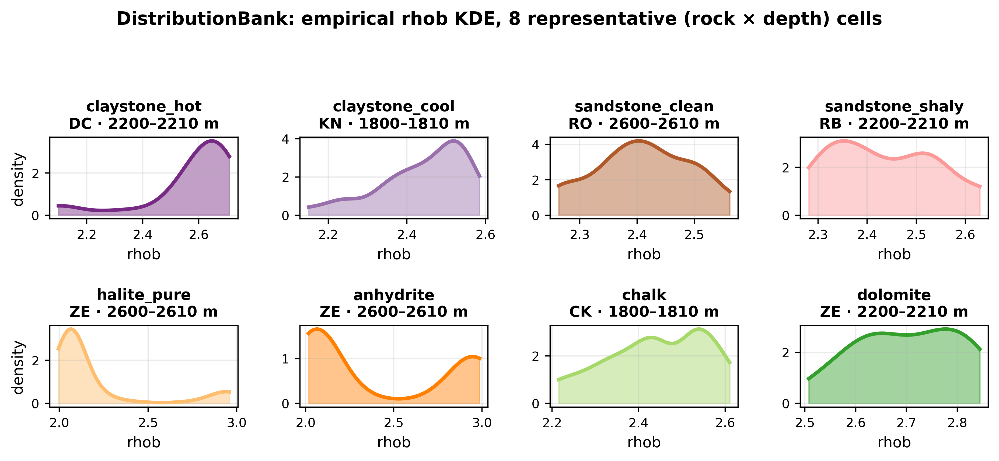
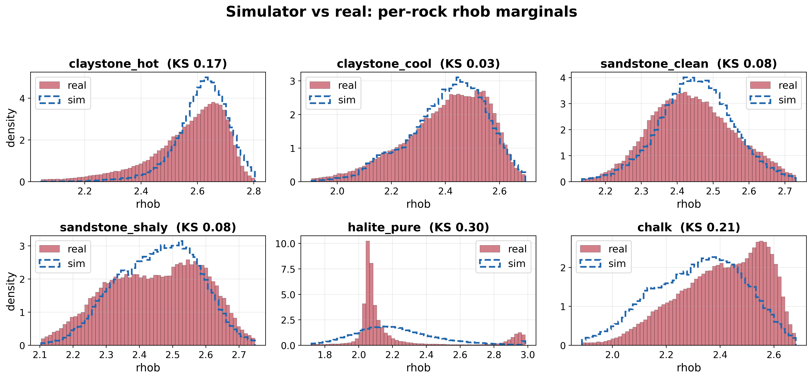
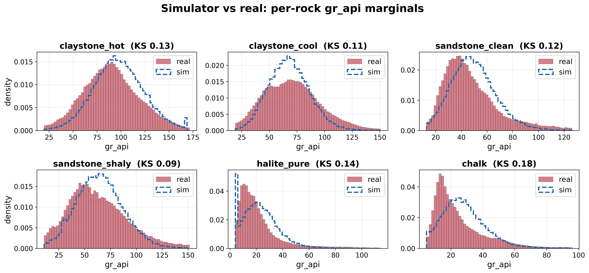
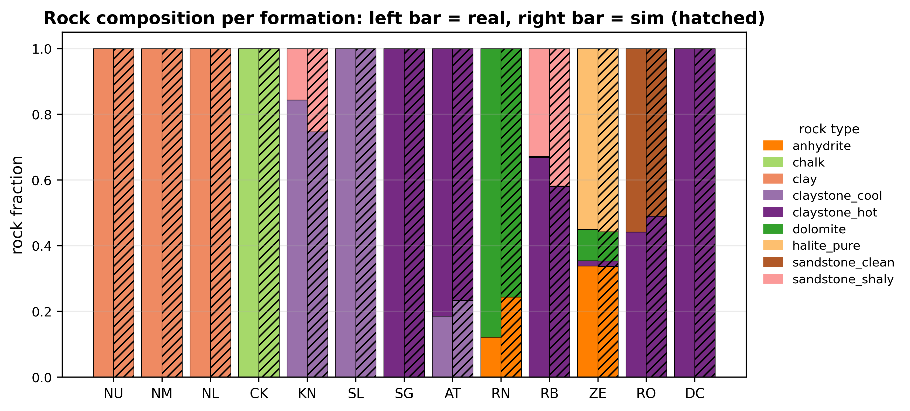
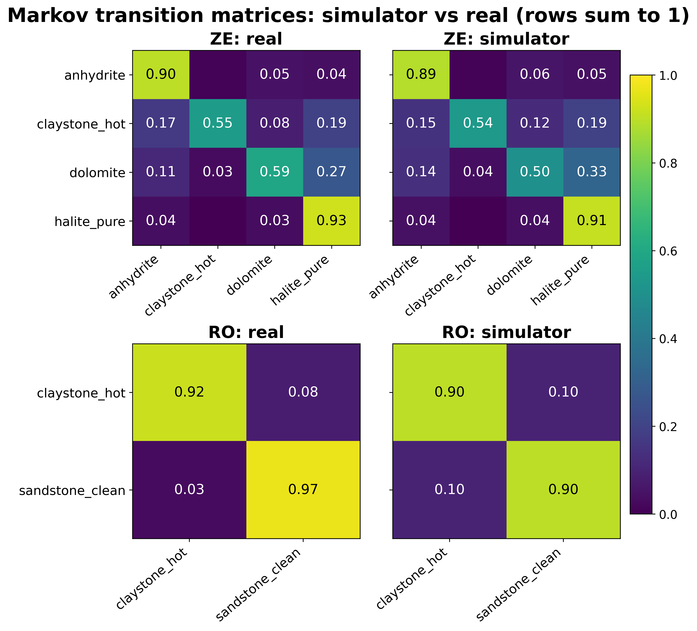
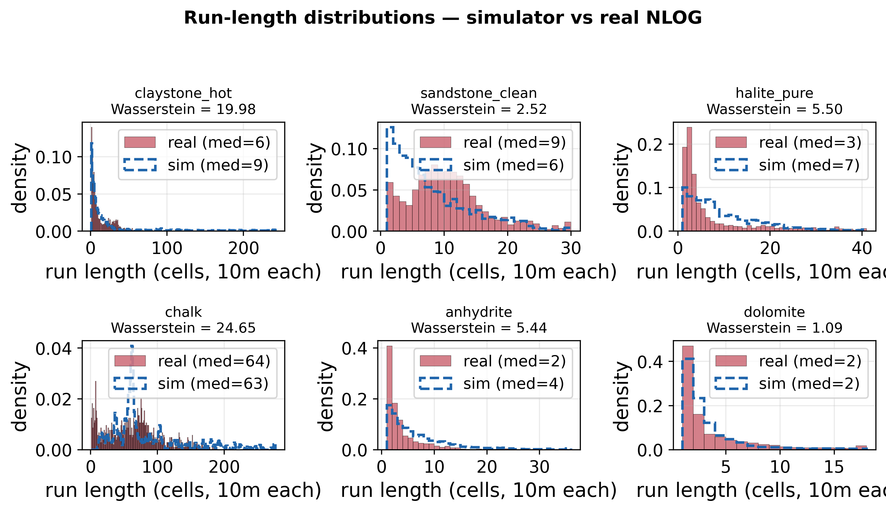
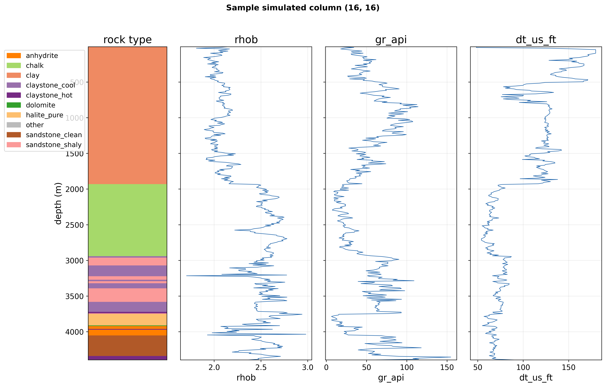
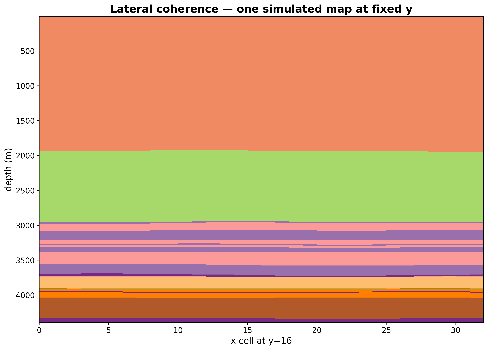
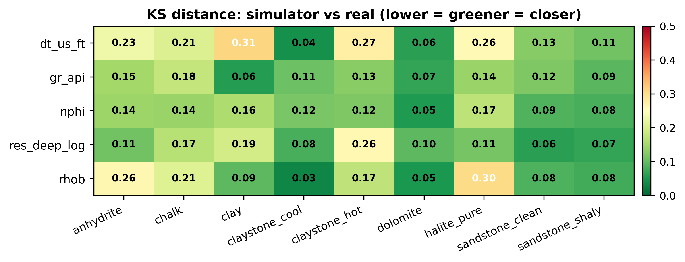

# Simulator validation report

Compared **500 synthetic maps** against `data/clean/samples.parquet` across four axes: petrophysical marginals, formation composition, vertical sequence statistics, and spatial structure.

## 1. DistributionBank — what the simulator draws from

**Figure 1** — empirical KDE of `rhob` for 8 representative (rock × depth-bin) cells.  The simulator samples directly from these KDEs; their shapes therefore *are* the simulator's petrophysical priors.

## 2. Per-rock marginals — sim vs real

**Worst-fit (rock × variable)** by KS statistic:

| rock | variable | KS | Wasserstein | sim p50 | real p50 |
|---|---|---|---|---|---|
| clay | dt_us_ft | 0.3087 | 21.6009 | 127.9524 | 158.298 |
| halite_pure | rhob | 0.3041 | 0.1255 | 2.1907 | 2.0767 |
| claystone_hot | dt_us_ft | 0.2737 | 6.8056 | 69.1087 | 73.3392 |
| anhydrite | rhob | 0.2631 | 0.1424 | 2.3308 | 2.1212 |
| claystone_hot | res_deep_log | 0.2603 | 0.268 | 0.9075 | 0.6134 |

(KS < 0.10 = excellent fit, < 0.30 = good, > 0.40 = systematic mismatch worth investigating.)

## 3. Formation composition — sim vs real

Total-variation distance per formation (lower = closer match to real corpus composition):

| formation | TVD (%) |
|---|---|
| CK | 0.0% |
| DC | 0.0% |
| NM | 0.0% |
| NL | 0.0% |
| NU | 0.0% |
| SL | 0.0% |
| SG | 0.0% |
| ZE | 0.8% |
| AT | 4.8% |
| RO | 4.8% |
| RB | 8.9% |
| KN | 9.7% |
| RN | 12.2% |

## 4. Vertical sequences — Markov transition matrices

Frobenius distance between sim and real transition matrices per formation (aligned on the union of observed rocks):

| formation | Frobenius | n rocks |
|---|---|---|
| CK | 0.0 | 1 |
| DC | 0.0 | 1 |
| SL | 0.0 | 1 |
| RB | 0.0745 | 3 |
| AT | 0.0905 | 2 |
| RN | 0.0995 | 2 |
| RO | 0.1035 | 2 |
| ZE | 0.1209 | 4 |
| KN | 0.1292 | 2 |

## 5. Spatial structure

Figure 7 shows one (x, y) column with its rock sequence and three variable curves.  Figure 8 shows lateral variability across the x-axis at fixed y — formation boundaries should wiggle smoothly (thanks to the anisotropic Gaussian random field used as boundary perturbation), not jump.

## 6. Summary

CSV tables alongside this report contain the full per-cell numbers:

- `per_rock_marginal_distances.csv` — KS + Wasserstein per (rock × variable)
- `per_formation_composition.csv` — sim/real rock-fractions + TVD
- `per_formation_transition_distance.csv` — Frobenius per formation
